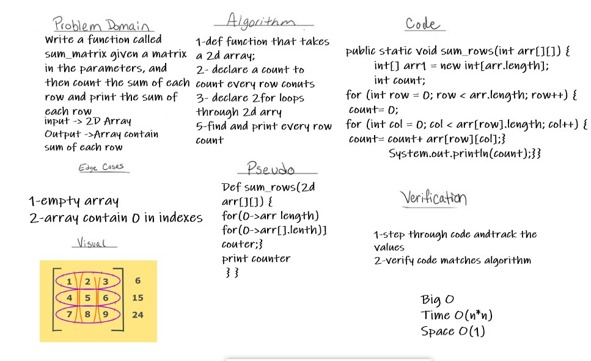

# Row Count
Write a function called sum_matrix given a matrix in the parameters, and then count the sum of each row and print the sum of each row 

## Whiteboard Process

## Approach & Efficiency
by simple function you can count rows
but maybe complixity O(n*n)could be better
I need to learn more about Big O & clean code.