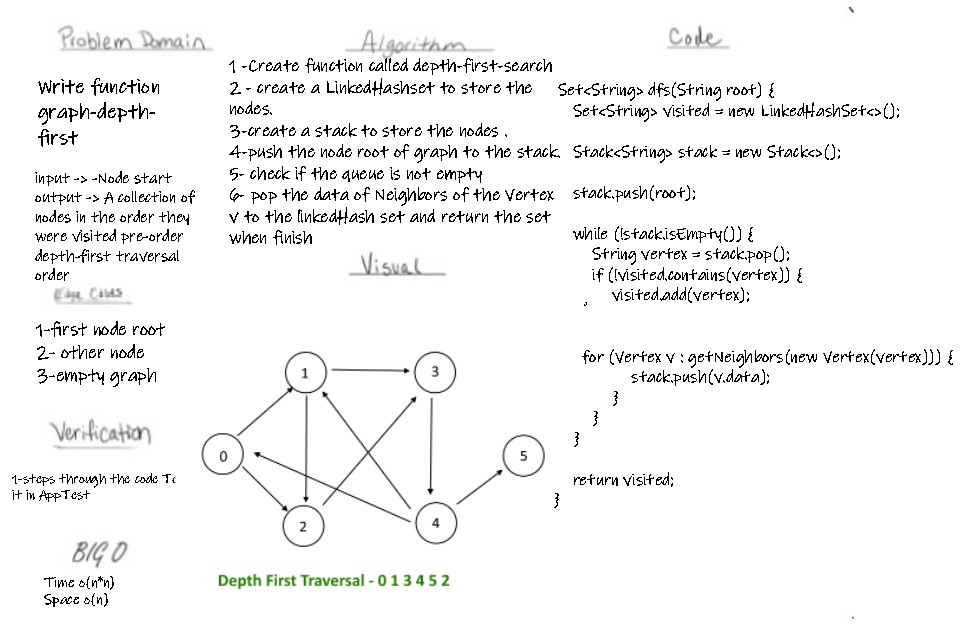
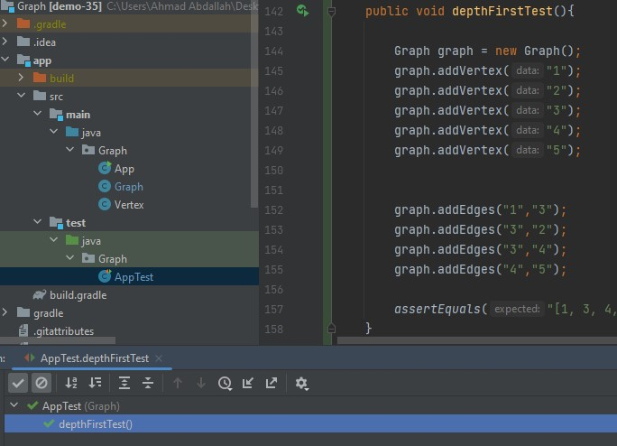

# Challenge Summary

# Depth First Traversal
Write a function  depth first preorder traversal on a graph using stack

## Challenge

## Approach & Efficiency
- Time o(n*n)
- Space o(n)

## Solution

