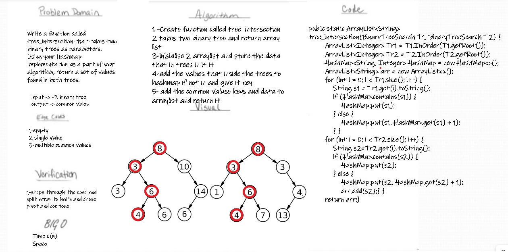

# Hashtables

  

## Challenge
Write a function called repeated word that finds the first word to occur more than once in a string

## Approach & Efficiency
The time complexity is O(n).
The space complexity is O(n)
## API

- 1 -Create function called repeated word
- 2 - split the text into words
- 3-delete any comas (,)
- 4-put every world in Hashtable and put the key the count of how many the world repeated
- 5- return find the first word to occur more than once in a string
- 6-if there is not any spesial repeted world return null
