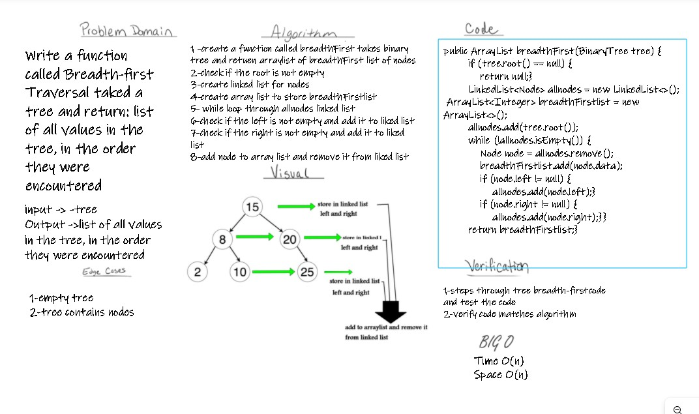

# Challenge Summary
Write a function called Breadth-first Traversal taked a tree and return: list of all values in the tree, in the order they were encountered
## Whiteboard Process

## Approach & Efficiency
Time O(n)
Space O(n)

