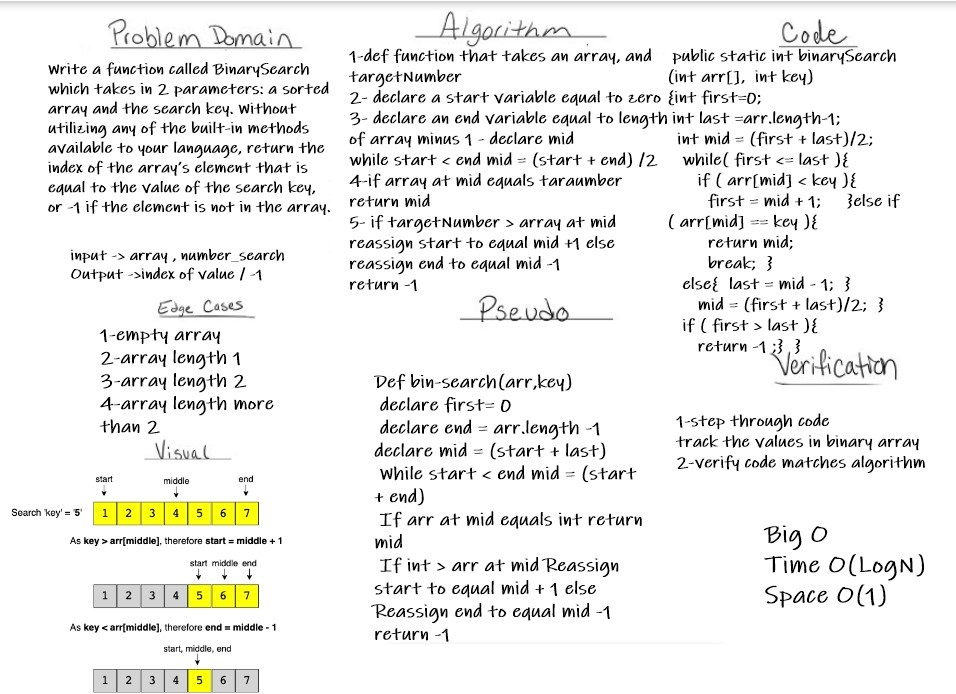

# Reverse an Array
Write a function called BinarySearch which takes in 2 parameters: a sorted array and the search key. Without utilizing any of the built-in methods available to your language, return the index of the array’s element that is equal to the value of the search key, or -1 if the element is not in the array.

## Whiteboard Process

## Approach & Efficiency
we declare start, end and mid variables after get the parameters
 In a for loop, we check if the mid-value matches the int value
 If it doesnot, we update our start and end variables to split the array into halves until start < end. Once arr[mid] == val, we return mid.
 If the while loop completes without location matches the number we are searching for  we return 
I need to learn more about Big O & clean code.