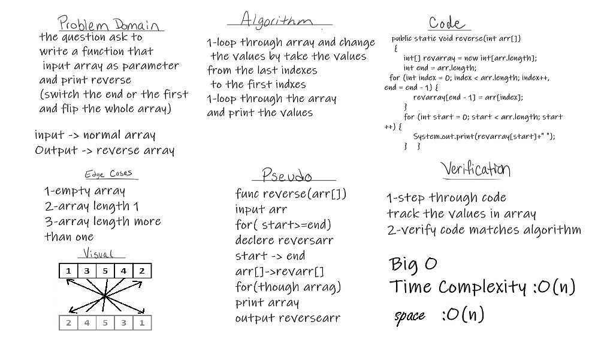

# Reverse an Array
Write a function called reverseArray which takes an array as an argument. Without utilizing any of the built-in methods available to your language, return an array with elements in reversed order.

## Whiteboard Process

## Approach & Efficiency
It takes about aone to two hour because there is alot of steps in whiteboard.
I need to learn more about Big O & clean code.