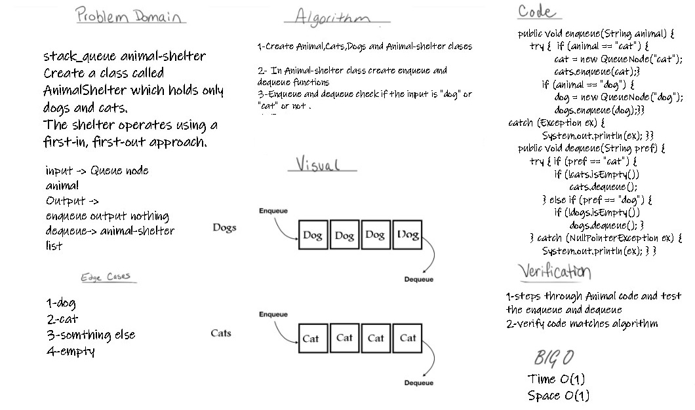
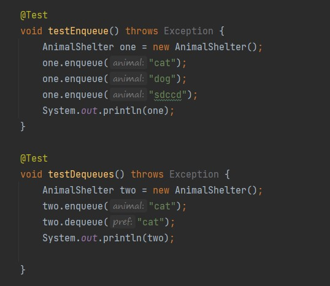

# Challenge Summary
Create a class called AnimalShelter which holds only dogs and cats.
The shelter operates using a first-in, first-out approach.
and impemet clases as queue
## Whiteboard Process

## Approach & Efficiency
time O(1)
space O(1)
## Solution

