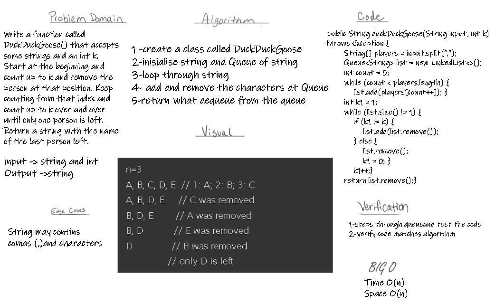
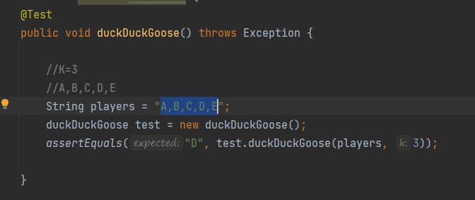

# Challenge Summary
Write a function called DuckDuckGoose() 
that accepts some strings and an int k.
Start at the beginning and count up to k
and remove the person at that position.
Keep counting from that index and count up to k
over and over until only one person is left. 
Return a string with the name of the last person left.
## Whiteboard Process

## Approach & Efficiency
time O(1)
space O(1)
## Solution

