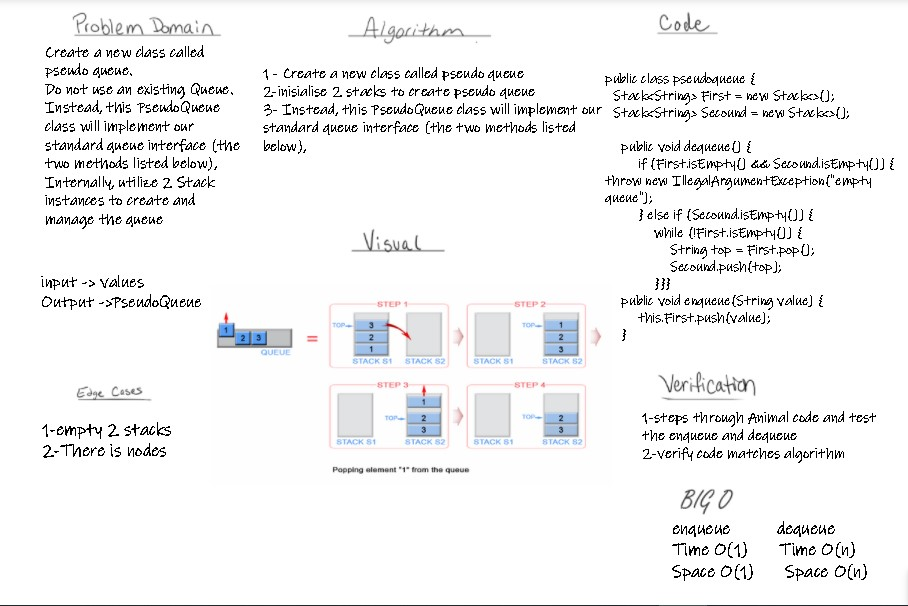
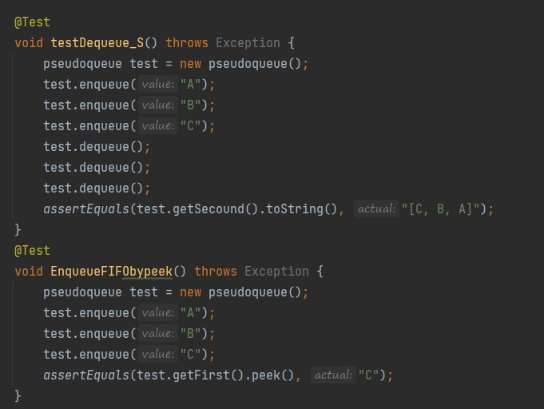

# Challenge Summary
- Create a new class called pseudo queue and
  Do not use an existing Queue.
  Instead, this PseudoQueue class will implement
  our standard queue interface
  (the two methods listed below),
  Internally, utilize 2 Stack instances to
  create and manage the queue
## Whiteboard Process

## Approach & Efficiency
- enequeue
time O(1)
space O(1)

- dequeue
 time O(n)
space O(n)

## Solution

