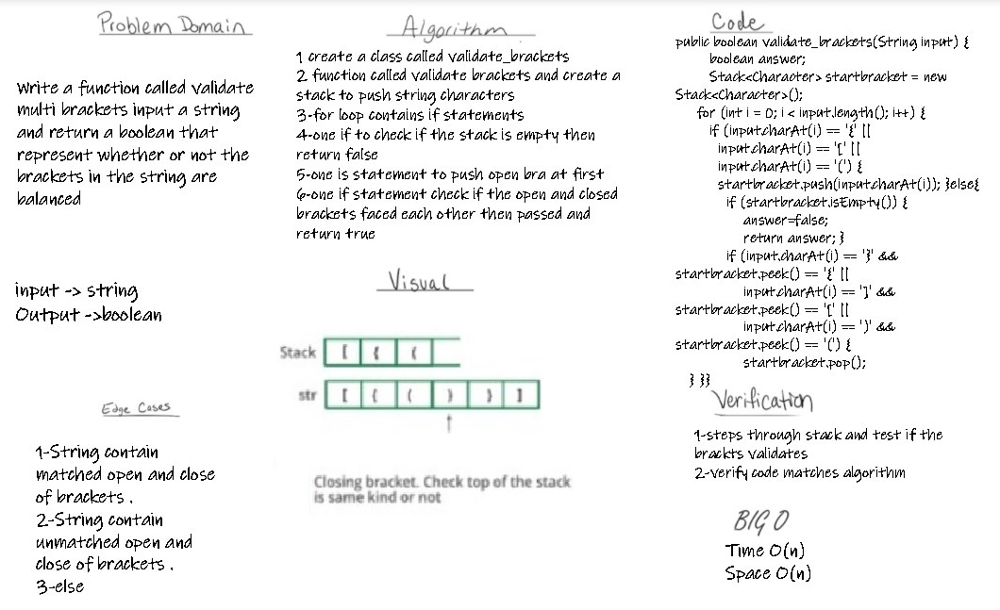
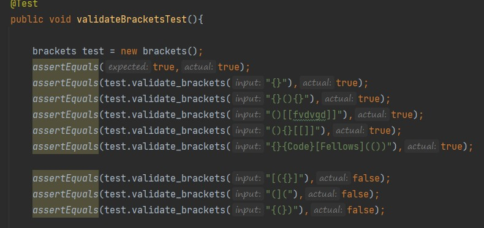

# Challenge Summary
 - Write a function called validate brackets
takes a string and return a boolean
representing whether or not 
the brackets in the string are balanced
## Whiteboard Process

## Approach & Efficiency

- time O(n)
- space O(n)

## Solution
